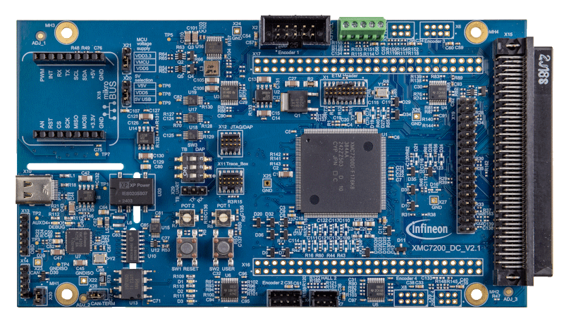

# KIT_XMC7200_DC_V1 BSP

## Overview

The KIT_XMC72_DC_V1, a 176-pin evaluation board is based on the XMC7200 family of devices. XMC7200 MCU is designed for  industrial applications. The evaluation board carries a XMC7200D microcontroller,and 100 pin High Density Motor Connector In addition, the board features an on-board programmer/debugger (Segger J-Link) with USB-UART VCOM interface,  MikroBUS connector interface, two user LEDs, two potentiometer, and two push buttons: (XRES and USR) The board supports operating voltages from 3.3 V to 5.0 V for XMC7200D device.

To use code from the BSP, simply include a reference to `cybsp.h`.

## Features

### Kit Features:

* XMC7200D-F176K8384AA 8MB Flash 176-pin TEQFP device
* Programming interface (Arm® Standard JTAG, Cortex® Debug + ETM with Arm® ETM Mictor)
* Reset control with manual reset switch and voltage supervision
* CAN FD interface
* Segger J-Link on-board SWD programmer/debugger, USB-UART bridge functionality
* A MikroBUS connector interface
* Selectable input supply voltages of 3.3 V and 5.0 V for the XMC7200D device
* Two user LEDs, one user button, and a reset button for the XMC7200D device
* Two potentiometers which can be used to simulate analog sensor output

### Kit Contents:

* KIT_XMC72_DC_V1
* USB Type-A to Type-C cable
* Quick start guide

## BSP Configuration

The BSP has a few hooks that allow its behavior to be configured. Some of these items are enabled by default while others must be explicitly enabled. Items enabled by default are specified in the KIT_XMC7200_DC_V1.mk file. The items that are enabled can be changed by creating a custom BSP or by editing the application makefile.

Components:
* Device specific category reference (e.g.: CAT1) - This component, enabled by default, pulls in any device specific code for this board.

Defines:
* CYBSP_WIFI_CAPABLE - This define, disabled by default, causes the BSP to initialize the interface to an onboard wireless chip if it has one.
* CY_USING_HAL - This define, enabled by default, specifies that the HAL is intended to be used by the application. This will cause the BSP to include the applicable header file and to initialize the system level drivers.
* CYBSP_CUSTOM_SYSCLK_PM_CALLBACK - This define, disabled by default, causes the BSP to skip registering its default SysClk Power Management callback, if any, and instead to invoke the application-defined function `cybsp_register_custom_sysclk_pm_callback` to register an application-specific callback.

### Clock Configuration

| Clock    | Source    | Output Frequency |
|----------|-----------|------------------|
| PLL      | ECO       | 100.0 MHz        |
| CLK_HF0  | CLK_PATH3 | 200 MHz          |
| CLK_HF1  | CLK_PATH1 | 350 MHz          |
| CLK_HF2  | CLK_PATH4 | 100 MHz          |
| CLK_HF3  | CLK_PATH3 | 100 MHz          |
| CLK_HF7  | CLK_PATH0 | 16 MHz           |

See the [BSP Setttings][settings] for additional board specific configuration settings.

## API Reference Manual

The KIT_XMC7200_DC_V1 Board Support Package provides a set of APIs to configure, initialize and use the board resources.

See the [BSP API Reference Manual][api] for the complete list of the provided interfaces.

## More information
* [KIT_XMC7200_DC_V1 BSP API Reference Manual][api]
* [KIT_XMC7200_DC_V1 Documentation](https://www.infineon.com/dgdl/Infineon-XMC-7200-Datasheet-DataSheet-v01_00-EN.pdf?fileId=8ac78c8c8412f8d30184443173374425)
* [Cypress Semiconductor, an Infineon Technologies Company](http://www.cypress.com)
* [Infineon GitHub](https://github.com/infineon)
* [ModusToolbox™](https://www.cypress.com/products/modustoolbox-software-environment)

[api]: https://infineon.github.io/TARGET_KIT_XMC7200_DC_V1/html/modules.html
[settings]: https://infineon.github.io/TARGET_KIT_XMC7200_DC_V1/html/md_bsp_settings.html

---
© Cypress Semiconductor Corporation (an Infineon company) or an affiliate of Cypress Semiconductor Corporation, 2019-2024.